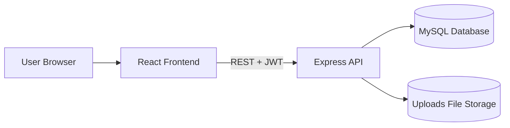
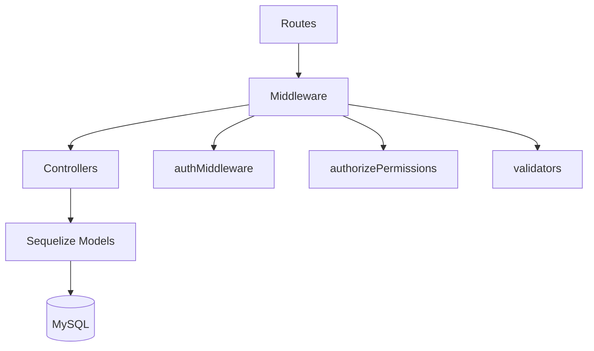
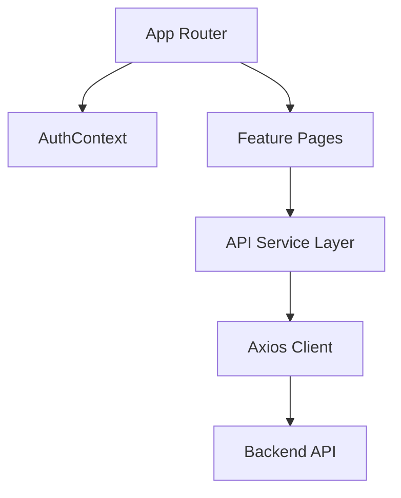

# 4M Change Management System Design

## 1. Architecture Summary

The application is a 3-tier web system:
- Presentation: React + Vite frontend
- Application: Express backend API
- Data: MySQL with Sequelize ORM

## 2. High-Level Architecture

## 3. Backend Component Design

### Layer Responsibilities

1. Routes
- Define endpoints and HTTP methods
- Attach middleware in sequence

2. Middleware
- Auth: token validation and user resolution
- Permission checks: RBAC by role permissions
- Validation: request body/query/params validation

3. Controllers
- Business logic and orchestration
- Calls model layer and response helpers

4. Models
- Sequelize schema definitions and associations
- Hooks and constraints

## 4. Frontend Component Design

### Frontend Flow

- `AuthContext` stores user and token state.
- `ProtectedRoute` checks role and permission before rendering pages.
- `services/api.js` centralizes all API calls.
- Axios interceptors inject token and handle 401 redirects.

## 5. Core Functional Flows

## 5.1 Login Flow

1. User submits credentials.
2. Backend validates user and returns JWT.
3. Frontend stores token and user data.
4. Subsequent requests include Bearer token.

## 5.2 Change Request Lifecycle

1. Create request (`Pending`).
2. Approval stage decisions (Approved/Rejected).
3. Implementation updates.
4. Monitoring and closure (`Implemented` -> `Closed`).

## 5.3 Master Data Administration

1. Admin opens master module.
2. CRUD operations run via specific or generic endpoints.
3. Role permissions control create/update/delete access.

## 6. Data Design Snapshot

Main entities:
- User, Role, RolePermission
- Department
- ChangeRequest
- Approval
- Attachment
- MasterData and specialized master tables
- GuidedSetupProgress

Key relationships:
- User belongs to Role and Department
- Role has RolePermission
- ChangeRequest has many Approvals
- Approval belongs to ChangeRequest and User (approver)
- Attachment belongs to ChangeRequest

## 7. Security Design

1. Authentication
- JWT-based auth for protected routes

2. Authorization
- Permission-based checks (`authorizePermissions`)
- SuperAdmin bypass in middleware

3. Input Validation
- `express-validator` for route-level validation

4. API Protection
- `helmet` for security headers
- `express-rate-limit` to control abuse
- CORS policy via env config

5. Password Security
- Password hashing using bcrypt hooks

## 8. File Handling Design

- Uploads stored on server filesystem (`./uploads`)
- Publicly served through `/uploads` static path
- Attachment metadata tracked in DB
- MIME-type and size validation in multer

## 9. Deployment and Configuration

### Backend
- Required envs: DB connection, JWT secret, superadmin credentials, CORS origin
- Port default: 5000

### Frontend
- Required env: `VITE_API_BASE_URL`
- Vite dev server default: 5174

## 10. Logging and Operations

- Logs organized under `logs/backend`, `logs/frontend`, `logs/system`
- Backend supports dev log capture via nodemon output piping

## 11. Design Strengths

- Clear separation of concerns
- Centralized RBAC model
- Consistent API layer in frontend
- Flexible master-data model for 4M customization

## 12. Risks and Improvement Areas

1. Generic `DELETE /masters/:id` permission is broad (`changes.update`); can be made category-specific.
2. Static local file storage for uploads may be replaced by object storage for scalability.
3. Add automated API tests and contract tests for long-term stability.
4. Consider audit logging for critical update/delete operations across modules.
